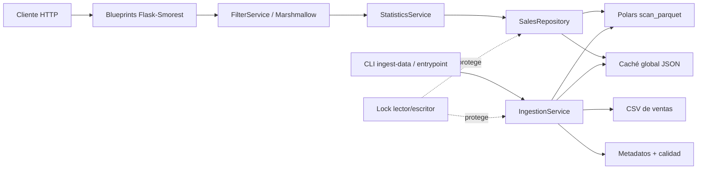
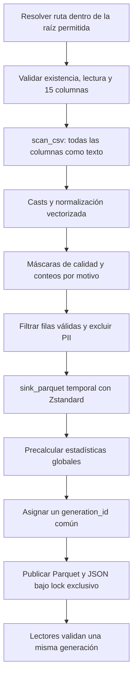

# Servicio REST de Resumen Estadístico de Ventas — Cruz Morada

API REST académica en Python y Flask que prepara un CSV de ventas con Polars, publica una representación Parquet y entrega estadísticas globales o filtradas sobre **MONTO APLICADO**. La solución prioriza procesamiento perezoso y vectorizado, un contrato de errores uniforme, documentación OpenAPI, pruebas automatizadas y ejecución reproducible en GNU/Linux o Docker.

El enunciado oficial se conserva en [`Trabajo ReST(1).md`](Trabajo%20ReST(1).md), las decisiones complementarias en [`PROMPT_CODEX.md`](PROMPT_CODEX.md) y la cobertura requisito a requisito en [`MATRIZ_TRAZABILIDAD.md`](MATRIZ_TRAZABILIDAD.md).

## 1. Objetivos

- Procesar archivos CSV grandes sin usar pandas como motor analítico.
- Preparar datos de forma desatendida y dejarlos disponibles antes de servir consultas.
- Exponer GET y POST en `/v1/estadisticas/ventas`.
- Calcular suma, conteo, promedio, mínimo, máximo, mediana y desviación estándar.
- Combinar filtros validados mediante AND, sin exponer datos personales.
- Ofrecer Swagger/OpenAPI, pruebas, calidad estática, Docker y CI.

## 2. Arquitectura

La aplicación usa factory pattern y separa transporte HTTP, validación, casos de uso, repositorio analítico e ingesta. Las dependencias se cablean explícitamente en `create_app`; el endpoint no conoce rutas físicas ni construye expresiones a partir de texto libre del usuario.



### Flujo de ingesta



Un lock interproceso de lectores/escritor protege el snapshot: las consultas adquieren un lock compartido y la publicación de una nueva generación adquiere el lock exclusivo. El Parquet, el resumen, los metadatos y el reporte de calidad incorporan el mismo `generation_id`; los lectores rechazan una combinación parcial o corrupta. El SHA-256, tamaño, `mtime`, versión de esquema y columna estadística permiten evitar trabajo si nada cambió; el hash detecta cambios aunque tamaño y fecha se conserven.

## 3. Tecnologías

- Python 3.12 o superior.
- Flask 3.1 y Flask-Smorest 0.47.
- Marshmallow 4 para esquemas y validación estructural.
- Polars 1.42 con LazyFrame y motor streaming.
- Parquet/PyArrow con compresión Zstandard.
- Pytest, coverage, Ruff y Mypy.
- Gunicorn, Docker Compose y GitHub Actions.

Todas son tecnologías open source disponibles nativamente en GNU/Linux.

## 4. Requisitos previos

- Python 3.12+ y `venv`.
- GNU Make, opcional pero recomendado.
- Docker y Docker Compose, solo para ejecución en contenedor.
- El CSV oficial o el fixture sintético incluido.

## 5. Instalación local

```bash
cp .env.example .env
python3 -m venv .venv
source .venv/bin/activate
python -m pip install --upgrade pip
python -m pip install -e ".[dev]"
```

También se puede ejecutar `make install` dentro del entorno virtual.

## 6. Configuración

Flask carga `.env` automáticamente en desarrollo. `.env` está ignorado por Git y `.env.example` no contiene credenciales.

| Variable | Predeterminado | Uso |
|---|---:|---|
| `APP_ENV` | `production` en código | `development` o `production` |
| `FLASK_DEBUG` | `0` | Solo se honra en desarrollo; producción fuerza debug apagado |
| `HOST` | `0.0.0.0` | Dirección de escucha |
| `BIND_ADDRESS` | `127.0.0.1` | Interfaz del host donde Docker Compose publica el puerto |
| `PORT` | `8000` | Puerto HTTP |
| `WORKERS` | `2` | Workers de Gunicorn |
| `LOG_LEVEL` | `INFO` | Nivel de logging JSON |
| `DATASET_PATH` | `data/ventas.csv` | CSV de origen |
| `PROCESSED_DATA_PATH` | `data/processed/ventas.parquet` | Parquet analítico |
| `SUMMARY_CACHE_PATH` | `data/processed/statistics.json` | Resumen global |
| `METADATA_PATH` | `data/processed/metadata.json` | Huella y estado de ingesta |
| `QUALITY_REPORT_PATH` | `data/processed/quality_report.json` | Conteos de descarte |
| `INGEST_ALLOWED_ROOT` | raíz del proyecto | Límite antitraversal para rutas CLI |
| `STAT_TARGET_COLUMN` | `MONTO APLICADO` | Columna contractual; no es elegible por el cliente |
| `AUTO_INGEST` | `false` en código | `entrypoint.sh` ingiere antes de Gunicorn si es verdadero |
| `MAX_REQUEST_BODY_BYTES` | `16384` | Límite global del body HTTP, antes de resolver el endpoint |
| `POLARS_MAX_THREADS` | Polars decide | Pool de cálculo; debe definirse antes de iniciar Python |

`WORKERS × POLARS_MAX_THREADS` debe ajustarse a los núcleos disponibles para evitar sobreasignación.

## 7. Cómo obtener o ubicar el CSV

El enunciado publica el [dataset oficial en Google Drive](https://drive.google.com/file/d/15jLBlJ9eMQSoHsoCMnFWBGopr98FIHlK/view?usp=sharing). Descárguelo manualmente como `data/ventas.csv` o pruebe el descargador streaming:

```bash
python scripts/download_data.py --output data/ventas.csv
```

Google Drive puede exigir confirmación interactiva para archivos grandes; si devuelve HTML, el script se detiene sin reemplazar el destino y se debe usar el enlace manual.

Para probar sin Internet ni datos reales:

```bash
python scripts/generate_sample_data.py
```

El generador usa los casos sintéticos de `datos.json`. Las pruebas siempre usan `tests/fixtures/ventas.csv` y nunca descargan el dataset real.

## 8. Ejecutar la ingesta

```bash
flask --app "app:create_app()" ingest-data --csv data/ventas.csv
```

Para reprocesar deliberadamente:

```bash
flask --app "app:create_app()" ingest-data --csv data/ventas.csv --force
```

La ingesta detecta automáticamente CSV separados por coma o punto y coma. También acepta `GENERO` sin tilde como alias de la cabecera contractual `GÉNERO`, diferencia observada en el archivo oficial descargable; el esquema interno continúa usando el nombre normalizado.

El comando valida ruta, permisos, extensión y columnas; lee perezosamente, descarta de forma controlada filas inutilizables, informa cuántas descartó y genera:

- `ventas.parquet` con solo ocho columnas analíticas necesarias;
- `statistics.json` con el resumen global;
- `metadata.json` con tamaño, `mtime`, SHA-256, filas y duración;
- `quality_report.json` con cada motivo de invalidez.

## 9. Iniciar la API

Después de la ingesta:

```bash
flask --app "app:create_app()" run --host 0.0.0.0 --port 8000
```

En producción local:

```bash
gunicorn --config gunicorn.conf.py wsgi:app
```

La ingesta costosa no ocurre dentro de cada worker. `scripts/entrypoint.sh` la ejecuta una vez, bajo lock, antes de reemplazarse por Gunicorn.

## 10. Docker

Primero ubique el CSV en `data/ventas.csv` y luego ejecute:

```bash
docker compose up --build
```

El contenedor:

- usa Python 3.12 slim y un usuario sin privilegios;
- aplica UTC−4 fijo como zona de negocio para timestamps sin offset;
- publica el puerto solo en `127.0.0.1` por defecto mediante `BIND_ADDRESS`;
- monta `./data/ventas.csv` como archivo de solo lectura;
- conserva Parquet, caché, metadatos y calidad en el volumen nombrado `processed-data`;
- ingiere cuando `AUTO_INGEST=true`;
- arranca Gunicorn mediante `exec`, conservando señales de terminación;
- elimina capabilities, habilita `no-new-privileges` y expone un healthcheck;
- desactiva el access log de Gunicorn; el logging estructurado propio no incluye valores de filtros.

Si `AUTO_INGEST=false`, el entrypoint exige que los artefactos procesados ya existan. Para aceptar conexiones desde otra máquina se puede cambiar `BIND_ADDRESS`, pero no se debe exponer este servicio directamente a Internet: un despliegue público necesita un proxy o gateway con TLS, autenticación y rate limiting.

## 11. Endpoints de estado

`GET /health` solo comprueba que el proceso responde:

```json
{"status": "ok"}
```

`GET /ready` intenta leer Parquet, caché, metadatos y calidad bajo lock compartido, y comprueba que sus `generation_id` coincidan. Devuelve `{"status":"ready"}` o HTTP 503 con el contrato de error, sin exponer rutas.

## 12. Swagger y OpenAPI

- Swagger UI: `http://localhost:8000/docs`
- Documento OpenAPI 3.0.3: `http://localhost:8000/openapi.json`

El documento describe GET, POST, filtros, enumeraciones, ejemplos válidos e inválidos, las siete métricas y los errores, incluido HTTP 413 cuando el body supera el límite global. La UI carga sus archivos estáticos desde jsDelivr; `/openapi.json` y la API no dependen de esa CDN.

## 13. Contrato de estadísticas

Toda respuesta exitosa tiene exactamente:

```json
{
  "suma": 1500.5,
  "conteo": 42,
  "promedio": 35.73,
  "minimo": 10.0,
  "maximo": 100.0,
  "mediana": 30.0,
  "desviacion_estandar": 25.4
}
```

Las métricas se calculan sobre `MONTO APLICADO`. `conteo` cuenta filas válidas coincidentes. La desviación estándar es **poblacional**, con `ddof=0`. No se serializan `NaN` ni infinito.

Sin coincidencias se responde HTTP 200:

```json
{
  "suma": 0.0,
  "conteo": 0,
  "promedio": null,
  "minimo": null,
  "maximo": null,
  "mediana": null,
  "desviacion_estandar": null
}
```

## 14. Filtros

Los nombres son exactos y en mayúsculas; no existen filtros públicos adicionales.

| Filtro | Tipo/regla | Columna interna |
|---|---|---|
| `GENERO` | No especificado, Masculino, Femenino u Otro; valor sin distinción de mayúsculas | `genero_texto` |
| `EDAD` | Entero 0..120, sin booleanos ni decimales | `edad_en_transaccion` |
| `CANAL` | POS, WEB, APP, CCT, APR o WPR; se normaliza a mayúsculas | `canal` |
| `CODIGO_PRODUCTO` | Entero positivo | `sku` |
| `ID_PERSONA` | UUID sintácticamente válido, normalizado a forma canónica | `codigo_cliente` |
| `LOCAL` | Entero positivo | `local` |
| `FECHA_DESDE` | Fecha/fecha-hora ISO 8601 inclusiva | `fecha` |
| `FECHA_HASTA` | Fecha/fecha-hora ISO 8601 inclusiva | `fecha` |

Una `FECHA_HASTA` sin hora incluye el día completo mediante el límite equivalente de medianoche siguiente exclusiva. Si ambos límites existen, desde no puede ser posterior a hasta.

## 15. Tratamiento de edad, género y tiempo

La edad se calcula vectorialmente en la fecha local de cada transacción, restando un año si el cumpleaños aún no había ocurrido. Esto evita que el resultado cambie con la fecha actual.

Mapeo de `GÉNERO` del CSV:

- `1` → Masculino;
- `2` → Femenino;
- otro código no cero → Otro;
- `0`, vacío, nulo o no informado → No especificado.

Por prioridad del enunciado oficial, las fechas sin offset se interpretan con un desplazamiento fijo UTC−4, sin aplicar horario de verano. Cuando el timestamp trae un offset explícito —por ejemplo, `Z`, `-04:00` o `+01:00`— ese offset se respeta antes de normalizar el instante. El Parquet guarda los instantes en UTC.

## 16. Ejemplos GET

Global precomputado:

```bash
curl --fail-with-body http://localhost:8000/v1/estadisticas/ventas
```

Varios filtros combinados con AND:

```bash
curl --get http://localhost:8000/v1/estadisticas/ventas \
  --data-urlencode 'GENERO=Femenino' \
  --data-urlencode 'CANAL=POS' \
  --data-urlencode 'LOCAL=1999'
```

Rango de fechas:

```bash
curl --get http://localhost:8000/v1/estadisticas/ventas \
  --data-urlencode 'FECHA_DESDE=2026-05-01' \
  --data-urlencode 'FECHA_HASTA=2026-05-31'
```

## 17. Ejemplo POST

```bash
curl --request POST http://localhost:8000/v1/estadisticas/ventas \
  --header 'Content-Type: application/json' \
  --data '{
    "consultas": [
      {"consulta": "GENERO", "valor": "Femenino"},
      {"consulta": "EDAD", "valor": "31"},
      {"consulta": "CANAL", "valor": "POS"}
    ]
  }'
```

POST exige una lista no vacía, rechaza filtros duplicados y propiedades desconocidas. Los errores de validación contractual son 400, no 422.

## 18. Formato de error

Todos los errores controlados usan nueve campos:

```json
{
  "detail": "El valor 'qwerqwer' no es un número entero válido para el ID de tienda",
  "instance": "/v1/estadisticas/ventas",
  "status": 400,
  "title": "Bad Request",
  "type": "https://developer.mozilla.org/es/docs/Web/HTTP/Reference/Status/400",
  "timestamp": "2026-06-30T20:44:49.201437Z",
  "errorCode": "VF",
  "errorLabel": "Validación Fallida",
  "method": "POST"
}
```

Se manejan 400, 404, 405, 413, 415, cualquier 422 de biblioteca convertido a 400, 500 y 503. El límite de body se aplica globalmente, no solo al POST de estadísticas. Los fallos inesperados registran stack trace internamente con request ID, pero la respuesta no revela excepción, stack ni ruta interna.

## 19. Procesamiento paralelo y escalabilidad

`scan_csv` y `scan_parquet` construyen planes perezosos; Polars ejecuta expresiones vectorizadas en su pool multihilo. Los filtros se aplican antes de las agregaciones, y Parquet habilita predicate/projection pushdown. `sink_parquet(engine="streaming")` evita convertir la tabla completa en listas de Python. Solo una fila agregada se materializa para cada consulta.

Esta implementación ofrece paralelismo local, no un clúster distribuido. El repositorio está desacoplado para poder sustituir Polars por Dask o Spark si un despliegue futuro requiere partición entre nodos.

## 20. Calidad de datos y privacidad

Una fila se descarta si falla cualquier regla estructural necesaria: fecha, canal, SKU, producto, unidades, descuento, monto, boleta, local, UUID, nacimiento, género informado o edad. El reporte conserva conteos por motivo; una fila puede sumar en varios motivos, por lo que esos subtotales no tienen que igualar el total descartado.

El Parquet analítico no contiene `RUN CLIENTE`, `NOMBRES`, `APELLIDOS`, `BOLETA`, producto, nacimiento ni otros campos innecesarios. El UUID se conserva solo porque `ID_PERSONA` es un filtro obligatorio; nunca se devuelve ni se incluye en logs. El access log de Gunicorn está desactivado y el logger estructurado de la aplicación registra la ruta sin query string, por lo que tampoco registra boletas ni valores de filtros.

## 21. Seguridad y robustez

- JSON estricto y rechazo de propiedades desconocidas.
- Body limitado globalmente por `MAX_REQUEST_BODY_BYTES`.
- Rutas de ingesta resueltas y restringidas a `INGEST_ALLOWED_ROOT`.
- Filtros compilados desde una enumeración; no se evalúa código ni se construye SQL.
- Sin CORS abierto, sin secretos y con debug forzado a apagado en producción, incluso si `FLASK_DEBUG` se configuró por error.
- Request/correlation ID validado o generado por solicitud.
- Cabeceras `nosniff`, `DENY`, política de referencia y permisos restrictivos.
- Snapshot protegido por lock interproceso de lectores/escritor y `generation_id` común en Parquet/JSON.
- Usuario Docker no root, capacidades eliminadas y timeouts de Gunicorn.
- Publicación Docker restringida a localhost por defecto; una exposición pública requiere TLS, autenticación y rate limiting externos.

## 22. Pruebas y calidad

```bash
make lint
make typecheck
make test
```

Equivalentes directos:

```bash
ruff check .
ruff format --check .
mypy app
pytest --cov=app --cov-report=term-missing
```

La cobertura mínima configurada es 85 %. La suite cubre cálculos, fechas, todos los filtros, GET, POST, errores, seguridad, OpenAPI, health/readiness, ingesta, caché, hash, CLI y exclusión de datos personales. CI ejecuta los mismos controles en push y pull request sin descargar datos.

Última verificación integral (13 de julio de 2026, entorno local; el sello UTC de los logs corresponde al 14 de julio): **172 pruebas aprobadas y 91,74 % de cobertura**. Ruff, formato y Mypy finalizaron sin hallazgos. La imagen Python 3.12 se construyó y ejecutó como UID 10001; `/health`, `/ready`, GET, POST, error 400, `/docs` y `/openapi.json` fueron comprobados mediante HTTP real.

## 23. Estructura del proyecto

```text
.
├── app/
│   ├── api/                 # ventas, health y ready
│   ├── cli/                 # ingest-data
│   ├── domain/              # enums, modelos y excepciones
│   ├── errors/              # fábrica y handlers uniformes
│   ├── observability/       # logging, request ID y headers
│   ├── repositories/        # consultas lazy sobre Parquet
│   ├── schemas/             # Marshmallow/OpenAPI
│   ├── services/            # filtros, estadísticas e ingesta
│   └── utils/               # fechas, hash, JSON atómico y lock
├── data/processed/          # artefactos ignorados por Git
├── scripts/                 # entrypoint, descarga y datos sintéticos
├── tests/                   # fixture y pruebas unitarias/integración
├── .github/workflows/ci.yml
├── Dockerfile
├── docker-compose.yml
├── gunicorn.conf.py
├── pyproject.toml
├── datos.json
└── wsgi.py
```

## 24. Decisiones, supuestos y contradicciones

El enunciado oficial tiene prioridad. Se resolvieron y documentaron estos puntos:

1. El texto general permite consultas sin filtros, pero validaciones exige error para `consultas` vacío/nulo. GET admite cero filtros; POST exige al menos uno.
2. El enunciado no identifica la columna estadística. Se usa `MONTO APLICADO` según el prompt complementario.
3. `CODIGO_PRODUCTO` aparece descrito por error como identificador de persona. Se mapea a `SKU`; `ID_PERSONA` se mapea a `CODIGO CLIENTE`.
4. La tabla menciona UUID v3, pero su ejemplo no coincide y hoy existen más versiones. Se valida sintaxis UUID general y se normaliza, sin restringir versión.
5. Una sección llama opcionales a las pruebas, pero Entregables las exige. Se consideran obligatorias.
6. La tabla de género solo describe 1/2, mientras el contrato exige cuatro valores. Se usa el mapeo ampliado de la sección anterior.
7. El oficial indica UTC−4 y el prompt `America/Santiago`. Prevalece el enunciado oficial: los timestamps sin offset usan UTC−4 fijo, sin DST; los offsets explícitos sí se respetan. La exigencia de zona IANA del prompt queda sustituida por esta regla de prioridad.
8. El oficial define desviación como raíz de varianza sin distinguir muestra/población. Se usa población (`ddof=0`).
9. El contexto menciona procesamiento distribuido; Polars satisface el requisito técnico explícito de paralelismo local, no implementa un clúster.
10. El timestamp de ejemplo muestra nanosegundos; se emite RFC 3339 UTC con microsegundos y sufijo `Z`, precisión soportada nativamente por Python.
11. El archivo oficial descargado usa separador `;` y cabecera `GENERO`, mientras el enunciado muestra `GÉNERO`. La ingesta detecta ambos delimitadores y normaliza ese alias sin modificar el archivo fuente.

## 25. Solución de problemas

**`El archivo CSV no existe`**: coloque el archivo en `DATASET_PATH` o pase `--csv` con una ruta dentro de `INGEST_ALLOWED_ROOT`.

**Faltan columnas**: respete mayúsculas, espacios y acentos de las 15 cabeceras oficiales, incluido `GÉNERO`.

**`/ready` devuelve 503**: ejecute `ingest-data` y confirme que Parquet y JSON pertenecen a la misma generación y que el volumen `processed-data` permite escritura al usuario del contenedor.

**Docker no inicia**: confirme que `data/ventas.csv` existe y es legible si `AUTO_INGEST=true`, o que el volumen nombrado contiene un snapshot procesado coherente si está desactivado.

**Swagger abre sin estilos**: la especificación sigue disponible en `/openapi.json`; revise acceso del navegador a jsDelivr.

**Demasiados hilos**: reduzca `WORKERS` o `POLARS_MAX_THREADS`.

## 26. Entregables

- Código fuente modular de la API.
- README con instrucciones y ejemplos.
- `datos.json` y CSV determinista de pruebas.
- Pruebas unitarias y de integración.
- Swagger/OpenAPI.
- Docker, Compose, Gunicorn y entrypoint.
- GitHub Actions y matriz de trazabilidad.

## 27. Entrega en GitHub

El estudiante debe crear/subir el repositorio y, desde **Settings → Collaborators**, agregar manualmente al profesor con usuario **`sebasalazar`**. El proyecto no afirma ni intenta realizar esta acción externa automáticamente.

La fecha oficial de entrega es el **17 de julio de 2026, hasta las 23:59:59.999999 hora continental de Chile**.
