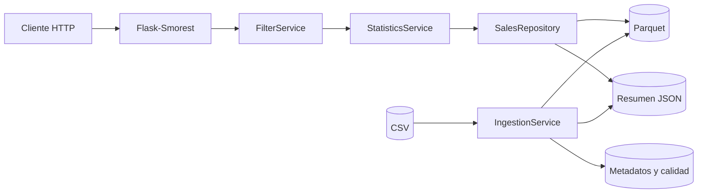

# Servicio REST de Estadísticas de Ventas

[](https://github.com/alanelap/servicio-rest-estadisticas-ventas/actions/workflows/ci.yml)


API REST para procesar un CSV de ventas de gran volumen y consultar estadísticas globales o
filtradas sobre **`MONTO APLICADO`**. Utiliza Flask para la API, Polars para el procesamiento
paralelo y Parquet para las consultas posteriores.

- **Endpoint principal:** `GET | POST /v1/estadisticas/ventas`
- **Documentación interactiva:** [Swagger](http://localhost:8000/docs)
- **Contrato:** [OpenAPI](http://localhost:8000/openapi.json)

> [!IMPORTANT]
> El CSV oficial no se versiona por su tamaño y porque contiene datos personales. Debe ubicarse
> localmente en `data/ventas.csv` antes de iniciar la aplicación.

## Inicio rápido con Docker

### 1. Clonar y preparar los datos

```bash
git clone https://github.com/alanelap/servicio-rest-estadisticas-ventas.git
cd servicio-rest-estadisticas-ventas
cp ~/Downloads/ventas_completas.csv data/ventas.csv
```

Si el archivo fue descargado con otro nombre, ajuste la ruta de origen del último comando.

### 2. Iniciar el servicio

```bash
docker compose up --build --detach
docker compose logs --follow api
```

La primera ejecución procesa el CSV antes de iniciar Gunicorn. El tiempo depende del tamaño del
archivo y de los recursos disponibles. Puede salir de los logs con `Ctrl+C` sin detener el
contenedor.

### 3. Verificar

```bash
docker compose ps
curl --fail-with-body http://localhost:8000/health
curl --fail-with-body http://localhost:8000/ready
curl --fail-with-body http://localhost:8000/v1/estadisticas/ventas
```

El contenedor debe aparecer como `healthy`; `/health` debe responder `ok` y `/ready`, `ready`.
Swagger queda disponible en <http://localhost:8000/docs>.

```bash
docker compose down
```

Las solicitudes periódicas a `/health` que aparecen en los logs pertenecen al healthcheck de
Docker y no ejecutan una nueva ingesta.

## Uso de la API

| Método | Ruta | Descripción |
|---|---|---|
| `GET` | `/v1/estadisticas/ventas` | Resumen global o consulta con query parameters |
| `POST` | `/v1/estadisticas/ventas` | Consulta con filtros en un body JSON |
| `GET` | `/health` | Indica si el proceso HTTP está activo |
| `GET` | `/ready` | Valida que los artefactos analíticos estén preparados |
| `GET` | `/docs` | Swagger UI |
| `GET` | `/openapi.json` | Documento OpenAPI 3.0.3 |

### GET

Resumen global precomputado:

```bash
curl --fail-with-body http://localhost:8000/v1/estadisticas/ventas
```

Consulta con filtros combinados mediante AND:

```bash
curl --get --fail-with-body http://localhost:8000/v1/estadisticas/ventas \
  --data-urlencode 'GENERO=Femenino' \
  --data-urlencode 'CANAL=POS' \
  --data-urlencode 'LOCAL=1999'
```

Rango de fechas inclusivo:

```bash
curl --get --fail-with-body http://localhost:8000/v1/estadisticas/ventas \
  --data-urlencode 'FECHA_DESDE=2026-05-01' \
  --data-urlencode 'FECHA_HASTA=2026-05-31'
```

### POST

```bash
curl --request POST --fail-with-body \
  --url http://localhost:8000/v1/estadisticas/ventas \
  --header 'Content-Type: application/json' \
  --data '{
    "consultas": [
      {"consulta": "GENERO", "valor": "Femenino"},
      {"consulta": "EDAD", "valor": "31"},
      {"consulta": "CANAL", "valor": "POS"}
    ]
  }'
```

POST requiere al menos una consulta y rechaza filtros duplicados, campos desconocidos y valores
que no cumplan el tipo esperado.

### Respuesta

Toda consulta exitosa devuelve exactamente siete estadísticas:

```json
{
  "suma": 1500.5,
  "conteo": 42,
  "promedio": 35.73,
  "minimo": 10.0,
  "maximo": 100.0,
  "mediana": 30.0,
  "desviacion_estandar": 25.4
}
```

La desviación estándar es poblacional (`ddof=0`). La API nunca serializa `NaN` ni infinito.
Cuando no hay coincidencias responde HTTP 200 con suma `0.0`, conteo `0` y las métricas no
aplicables en `null`:

```json
{
  "suma": 0.0,
  "conteo": 0,
  "promedio": null,
  "minimo": null,
  "maximo": null,
  "mediana": null,
  "desviacion_estandar": null
}
```

### Filtros

| Filtro | Valores o formato |
|---|---|
| `GENERO` | No especificado, Masculino, Femenino u Otro |
| `EDAD` | Entero entre 0 y 120 |
| `CANAL` | POS, WEB, APP, CCT, APR o WPR |
| `CODIGO_PRODUCTO` | SKU entero positivo |
| `ID_PERSONA` | UUID válido |
| `LOCAL` | Entero positivo |
| `FECHA_DESDE` | Fecha o fecha-hora ISO 8601, inclusiva |
| `FECHA_HASTA` | Fecha o fecha-hora ISO 8601, inclusiva |

Una `FECHA_HASTA` sin hora incluye el día completo. Si se envían ambos límites,
`FECHA_DESDE` no puede ser posterior a `FECHA_HASTA`.

### Errores

Ejemplo:

```bash
curl --get --fail-with-body http://localhost:8000/v1/estadisticas/ventas \
  --data-urlencode 'CANAL=INVALIDO'
```

```json
{
  "detail": "El canal debe ser uno de: POS, WEB, APP, CCT, APR, WPR",
  "instance": "/v1/estadisticas/ventas",
  "status": 400,
  "title": "Bad Request",
  "type": "https://developer.mozilla.org/es/docs/Web/HTTP/Reference/Status/400",
  "timestamp": "2026-07-14T03:00:00.000000Z",
  "errorCode": "VF",
  "errorLabel": "Validación Fallida",
  "method": "GET"
}
```

Todos los errores mantienen esta estructura. Los estados principales son:

| Estado | Caso |
|---:|---|
| 400 | Filtros, rangos o JSON inválidos |
| 404 / 405 | Ruta inexistente o método no permitido |
| 413 / 415 | Body demasiado grande o tipo de contenido no soportado |
| 500 | Error interno sin detalles sensibles |
| 503 | Datos ausentes, ilegibles o de generaciones diferentes |

Swagger incluye el esquema completo y ejemplos válidos e inválidos.

## Datos e ingesta

El [CSV oficial](https://drive.google.com/file/d/15jLBlJ9eMQSoHsoCMnFWBGopr98FIHlK/view?usp=sharing)
puede descargarse manualmente o mediante el script incluido:

```bash
python scripts/download_data.py --output data/ventas.csv
```

Para generar un CSV pequeño de demostración sin datos reales:

```bash
python scripts/generate_sample_data.py --output data/ventas_muestra.csv
```

El nombre alternativo evita sobrescribir `data/ventas.csv` si ya contiene el archivo oficial.

### Ingesta manual

```bash
flask --app "app:create_app()" ingest-data --csv data/ventas.csv
```

Para forzar el reprocesamiento:

```bash
flask --app "app:create_app()" ingest-data --csv data/ventas.csv --force
```

La ingesta:

- valida la ruta, permisos y las 15 columnas requeridas;
- detecta separadores coma o punto y coma;
- normaliza `GENERO` y `GÉNERO` al mismo campo;
- descarta filas inválidas de forma explícita;
- publica Parquet, estadísticas, metadatos y reporte de calidad como una misma generación;
- utiliza SHA-256 para evitar reprocesar un archivo sin cambios.

| Artefacto | Contenido |
|---|---|
| `ventas.parquet` | Columnas analíticas sin RUN, nombres ni apellidos |
| `statistics.json` | Resumen global sobre `MONTO APLICADO` |
| `metadata.json` | Huella, tamaño, fecha, filas y versión del esquema |
| `quality_report.json` | Filas descartadas y motivos agregados |

Con `AUTO_INGEST=true`, el entrypoint de Docker ejecuta la ingesta antes de iniciar Gunicorn. Un
lock impide que dos procesos publiquen simultáneamente.

### Reglas relevantes

- La edad se calcula en la fecha de la venta, no en la fecha actual.
- Género: `1` es Masculino, `2` Femenino, otro código no cero es Otro y `0` o vacío es No
  especificado.
- Los timestamps sin offset se interpretan como UTC-4 fijo; los offsets explícitos se respetan.
- `ID_PERSONA` acepta un UUID sintácticamente válido sin restringir su versión.

## Desarrollo local

Requisitos: Python 3.12 o superior, soporte para `venv` y el CSV oficial o el fixture sintético.
GNU Make es opcional.

```bash
cp .env.example .env
python3 -m venv .venv
source .venv/bin/activate
python -m pip install --upgrade pip
python -m pip install -e ".[dev]"
```

Prepare los datos e inicie Flask en la interfaz local:

```bash
make ingest
HOST=127.0.0.1 make run
```

También puede usar Gunicorn:

```bash
python -m dotenv run -- gunicorn --config gunicorn.conf.py wsgi:app
```

### Configuración principal

La configuración completa y sus valores de desarrollo están en
[`.env.example`](.env.example).

| Variable | Uso |
|---|---|
| `APP_ENV` | Entorno de ejecución |
| `HOST`, `PORT` | Interfaz y puerto internos |
| `BIND_ADDRESS` | Interfaz del host publicada por Docker |
| `DATASET_PATH` | Ruta del CSV de origen |
| `PROCESSED_DATA_PATH` | Ruta del Parquet procesado |
| `SUMMARY_CACHE_PATH` | Ruta del resumen global |
| `STAT_TARGET_COLUMN` | Columna estadística; por defecto `MONTO APLICADO` |
| `AUTO_INGEST` | Habilita la ingesta previa al arranque |
| `WORKERS` | Procesos de Gunicorn |
| `POLARS_MAX_THREADS` | Hilos máximos de Polars |
| `MAX_REQUEST_BODY_BYTES` | Límite global del body HTTP |

## Arquitectura y rendimiento



- `scan_csv` y `scan_parquet` construyen planes perezosos.
- Polars ejecuta expresiones vectorizadas y multihilo.
- Los filtros se aplican antes de las agregaciones mediante predicate pushdown.
- Parquet conserva únicamente las columnas necesarias y usa compresión Zstandard.
- El resumen global se precalcula; una consulta filtrada materializa solo su fila agregada.
- Locks de lectura y escritura mantienen una generación coherente durante consultas simultáneas.

El procesamiento es paralelo dentro de una máquina. La capa de repositorio permite sustituir el
motor analítico si en el futuro se requiere ejecución distribuida.

## Calidad y seguridad

Ejecute todos los controles locales con:

```bash
make check
```

Este comando comprueba:

```bash
ruff check .
ruff format --check .
mypy app
pytest --cov=app --cov-report=term-missing
```

La cobertura mínima exigida es 85 %. GitHub Actions ejecuta los mismos controles en cada push y
pull request usando únicamente el fixture local.

Medidas principales:

- JSON estricto, body limitado y rechazo de campos desconocidos;
- errores uniformes sin stack traces ni rutas internas;
- request ID, logging JSON y cabeceras defensivas;
- filtro de rutas para impedir path traversal en la ingesta;
- Docker sin usuario root, sin capabilities y con healthcheck;
- debug desactivado en producción y sin CORS abierto;
- Parquet sin RUN, nombres, apellidos ni otros campos personales innecesarios;
- logs sin query strings, cuerpos ni valores de filtros.

Para una exposición pública deben agregarse TLS, autenticación y control de tasa mediante un
proxy o gateway; la configuración incluida publica el servicio solo en la interfaz local.

## Decisiones principales

| Tema | Decisión |
|---|---|
| Consulta sin filtros | GET la permite; POST requiere al menos una consulta |
| Estadística objetivo | `MONTO APLICADO` |
| Desviación estándar | Poblacional (`ddof=0`) |
| `CODIGO_PRODUCTO` | Se mapea a `SKU` |
| Zona horaria | UTC-4 fijo para timestamps sin offset |
| CSV oficial | Se acepta `;` y el alias `GENERO` |

## Solución de problemas

| Problema | Solución |
|---|---|
| No se encuentra el CSV | Confirme que `data/ventas.csv` existe y es legible |
| `/ready` responde 503 | Ejecute la ingesta y verifique que todos los artefactos pertenezcan a la misma generación |
| Docker permanece en `starting` | Revise `docker compose logs --follow api`; la primera ingesta puede tardar según el equipo |
