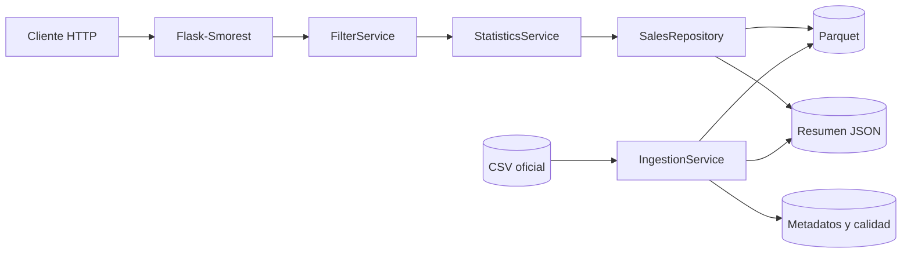
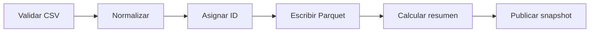

# Servicio REST de Estadísticas de Ventas

[](https://github.com/alanelap/servicio-rest-estadisticas-ventas/actions/workflows/ci.yml)


API REST académica para procesar un CSV de ventas de gran volumen y consultar estadísticas
globales o filtradas sobre **`MONTO APLICADO`**. La solución combina Flask, Polars y
Parquet para ofrecer ingesta reproducible, consultas vectorizadas, documentación OpenAPI,
pruebas automatizadas y ejecución segura mediante Docker.

**Proyecto:** Cruz Morada<br>
**Contrato principal:** `GET | POST /v1/estadisticas/ventas`<br>
**Documentación:** [Swagger](http://localhost:8000/docs) ·
[OpenAPI](http://localhost:8000/openapi.json) ·
[Matriz de trazabilidad](MATRIZ_TRAZABILIDAD.md)

> [!IMPORTANT]
> El CSV oficial no se incluye en Git por su tamaño y por contener datos sensibles. Debe
> ubicarse localmente en `data/ventas.csv` antes de iniciar la aplicación.

## Contenido

- [Objetivos y capacidades](#objetivos-y-capacidades)
- [Inicio rápido](#inicio-rápido)
- [API en un vistazo](#api-en-un-vistazo)
- [Arquitectura](#arquitectura)
- [Datos e ingesta](#datos-e-ingesta)
- [Desarrollo local](#desarrollo-local)
- [Docker y operación](#docker-y-operación)
- [Calidad y pruebas](#calidad-y-pruebas)
- [Seguridad y privacidad](#seguridad-y-privacidad)
- [Decisiones y trazabilidad](#decisiones-y-trazabilidad)
- [Entrega académica](#entrega-académica)

## Objetivos y capacidades

El servicio elimina tareas manuales de preparación y cálculo sobre el archivo de ventas. Sus
objetivos principales son:

- procesar millones de filas sin usar pandas como motor analítico;
- preparar los datos una sola vez y publicar un snapshot coherente antes de servir consultas;
- calcular suma, conteo, promedio, mínimo, máximo, mediana y desviación estándar;
- combinar filtros validados mediante AND sin exponer datos personales;
- responder GET y POST con un contrato estable de éxito y error;
- ejecutar de forma reproducible en GNU/Linux, macOS o Docker;
- mantener documentación Swagger/OpenAPI, CI y trazabilidad requisito a requisito.

## Inicio rápido

Docker Compose es el camino recomendado para evaluar el proyecto completo.

### 1. Clonar y preparar el CSV

```bash
git clone https://github.com/alanelap/servicio-rest-estadisticas-ventas.git
cd servicio-rest-estadisticas-ventas
cp ~/Downloads/ventas_completas.csv data/ventas.csv
```

Si el archivo tiene otro nombre o ubicación, sustituya la ruta de origen del último comando.

### 2. Construir e iniciar

```bash
docker compose up --build --detach
docker compose logs --follow api
```

La primera ejecución procesa el CSV antes de iniciar Gunicorn. Con el archivo oficial este paso
puede tardar varios minutos. Cuando aparezca el mensaje de inicio del servidor, salga de los logs
con `Ctrl+C`; el contenedor continuará ejecutándose.

### 3. Verificar

```bash
docker compose ps
curl --fail-with-body http://localhost:8000/health
curl --fail-with-body http://localhost:8000/ready
curl --fail-with-body http://localhost:8000/v1/estadisticas/ventas
```

El resultado esperado es un contenedor `healthy`, estados `ok` y `ready`, y un objeto con las
siete estadísticas. La interfaz interactiva queda disponible en
<http://localhost:8000/docs>.

> Las solicitudes `GET /health` que aparecen cada 30 segundos en los logs son el healthcheck de
> Docker. Un estado HTTP 200 confirma que el proceso sigue respondiendo; no indica un error ni una
> nueva ingesta.

Para detener el servicio:

```bash
docker compose down
```

## API en un vistazo

| Método | Ruta | Propósito |
|---|---|---|
| `GET` | `/v1/estadisticas/ventas` | Resumen global precomputado o consulta mediante query params |
| `POST` | `/v1/estadisticas/ventas` | Consulta con uno o más filtros en JSON |
| `GET` | `/health` | Comprueba que el proceso HTTP está activo |
| `GET` | `/ready` | Comprueba que el snapshot analítico es legible y coherente |
| `GET` | `/docs` | Swagger UI interactivo |
| `GET` | `/openapi.json` | Contrato OpenAPI 3.0.3 |

### GET

Resumen global precomputado:

```bash
curl --fail-with-body http://localhost:8000/v1/estadisticas/ventas
```

Filtros combinados mediante AND:

```bash
curl --get --fail-with-body http://localhost:8000/v1/estadisticas/ventas \
  --data-urlencode 'GENERO=Femenino' \
  --data-urlencode 'CANAL=POS' \
  --data-urlencode 'LOCAL=1999'
```

Rango de fechas inclusivo:

```bash
curl --get --fail-with-body http://localhost:8000/v1/estadisticas/ventas \
  --data-urlencode 'FECHA_DESDE=2026-05-01' \
  --data-urlencode 'FECHA_HASTA=2026-05-31'
```

### POST

```bash
curl --request POST --fail-with-body \
  --url http://localhost:8000/v1/estadisticas/ventas \
  --header 'Content-Type: application/json' \
  --data '{
    "consultas": [
      {"consulta": "GENERO", "valor": "Femenino"},
      {"consulta": "EDAD", "valor": "31"},
      {"consulta": "CANAL", "valor": "POS"}
    ]
  }'
```

POST exige una lista `consultas` no vacía. También rechaza filtros duplicados y propiedades no
definidas en el contrato.

### Respuesta estadística

Toda respuesta exitosa de `/v1/estadisticas/ventas` contiene exactamente:

```json
{
  "suma": 1500.5,
  "conteo": 42,
  "promedio": 35.73,
  "minimo": 10.0,
  "maximo": 100.0,
  "mediana": 30.0,
  "desviacion_estandar": 25.4
}
```

Las métricas se calculan sobre `MONTO APLICADO`. `conteo` representa filas válidas coincidentes
y la desviación estándar es **poblacional** (`ddof=0`). La respuesta nunca serializa `NaN` ni
infinito.

Cuando no existen coincidencias, el servicio responde HTTP 200:

```json
{
  "suma": 0.0,
  "conteo": 0,
  "promedio": null,
  "minimo": null,
  "maximo": null,
  "mediana": null,
  "desviacion_estandar": null
}
```

### Filtros disponibles

Los nombres son exactos y se pueden combinar en cualquier cantidad.

| Filtro | Tipo y validación | Columna analítica |
|---|---|---|
| `GENERO` | No especificado, Masculino, Femenino u Otro; sin distinción de mayúsculas | `genero_texto` |
| `EDAD` | Entero entre 0 y 120; no admite booleanos ni decimales | `edad_en_transaccion` |
| `CANAL` | POS, WEB, APP, CCT, APR o WPR | `canal` |
| `CODIGO_PRODUCTO` | Entero positivo | `sku` |
| `ID_PERSONA` | UUID sintácticamente válido, normalizado a formato canónico | `codigo_cliente` |
| `LOCAL` | Entero positivo | `local` |
| `FECHA_DESDE` | Fecha o fecha-hora ISO 8601, límite inclusivo | `fecha` |
| `FECHA_HASTA` | Fecha o fecha-hora ISO 8601, límite inclusivo | `fecha` |

Una `FECHA_HASTA` sin hora incluye el día completo. Si se informan ambos límites,
`FECHA_DESDE` no puede ser posterior a `FECHA_HASTA`.

### Errores

Ejemplo de solicitud inválida:

```bash
curl --get --fail-with-body http://localhost:8000/v1/estadisticas/ventas \
  --data-urlencode 'CANAL=INVALIDO'
```

Todos los errores controlados mantienen el mismo contrato de nueve campos:

```json
{
  "detail": "El canal debe ser uno de: POS, WEB, APP, CCT, APR, WPR",
  "instance": "/v1/estadisticas/ventas",
  "status": 400,
  "title": "Bad Request",
  "type": "https://developer.mozilla.org/es/docs/Web/HTTP/Reference/Status/400",
  "timestamp": "2026-07-14T03:00:00.000000Z",
  "errorCode": "VF",
  "errorLabel": "Validación Fallida",
  "method": "GET"
}
```

| Estado | Caso |
|---:|---|
| 400 | Filtros, rangos o JSON inválidos; los 422 internos se normalizan a 400 |
| 404 / 405 | Ruta inexistente o método no permitido |
| 413 / 415 | Body demasiado grande o tipo de contenido no soportado |
| 500 | Error interno sin exposición de stack trace ni rutas físicas |
| 503 | `/ready` detecta artefactos ausentes, corruptos o de generaciones diferentes |

Swagger documenta ejemplos válidos e inválidos y permite ejecutar solicitudes con **Try it out**.

## Arquitectura

La aplicación usa un patrón de fábrica y separa transporte HTTP, validación, casos de uso,
persistencia analítica e ingesta. Las dependencias se ensamblan explícitamente en `create_app`;
los endpoints no conocen rutas físicas ni construyen expresiones desde texto libre del cliente.

### Componentes



### Flujo de ingesta



El `generation_id` se genera antes de escribir el Parquet porque forma parte de sus metadatos.
Un lock interproceso de lectores y escritor protege la publicación: las consultas adquieren un
lock compartido y la ingesta un lock exclusivo. Parquet, resumen, metadatos y reporte de calidad
deben compartir la misma generación; una combinación parcial o corrupta se rechaza.

### Estrategia de rendimiento

- `scan_csv` y `scan_parquet` construyen planes perezosos de Polars.
- El motor usa expresiones vectorizadas y un pool multihilo.
- Los filtros se aplican antes de agregar y aprovechan predicate/projection pushdown.
- `sink_parquet(engine="streaming")` evita materializar el dataset como listas de Python.
- Parquet usa compresión Zstandard y conserva solo ocho columnas analíticas.
- El resumen global se precalcula; las consultas filtradas materializan una única fila agregada.

La solución ofrece paralelismo local, no un clúster distribuido. El repositorio analítico está
desacoplado para permitir una futura sustitución por Dask o Spark si se requiere partición entre
nodos.

## Datos e ingesta

### Obtener el CSV

El enunciado publica el
[dataset oficial en Google Drive](https://drive.google.com/file/d/15jLBlJ9eMQSoHsoCMnFWBGopr98FIHlK/view?usp=sharing).
Puede descargarse manualmente y guardarse como `data/ventas.csv`, o utilizar el descargador
streaming:

```bash
python scripts/download_data.py --output data/ventas.csv
```

Google Drive puede solicitar confirmación para archivos grandes. Si el servidor devuelve HTML,
el script se detiene sin sobrescribir el destino y debe usarse la descarga manual.

Para una demostración sin Internet ni datos reales:

```bash
python scripts/generate_sample_data.py
```

El generador usa `datos.json`. Las pruebas utilizan exclusivamente
`tests/fixtures/ventas.csv` y nunca descargan el dataset real.

### Ejecutar la ingesta

```bash
flask --app "app:create_app()" ingest-data --csv data/ventas.csv
```

Para reprocesar aun cuando la huella del archivo no cambió:

```bash
flask --app "app:create_app()" ingest-data --csv data/ventas.csv --force
```

La ingesta valida ruta, permisos, extensión y las 15 columnas contractuales. Detecta CSV
separados por coma o punto y coma y acepta el alias `GENERO` del archivo oficial para la cabecera
`GÉNERO`, manteniendo el nombre normalizado internamente.

| Artefacto | Contenido |
|---|---|
| `ventas.parquet` | Ocho columnas analíticas, sin nombres, apellidos, RUN ni boleta |
| `statistics.json` | Resumen global sobre `MONTO APLICADO` |
| `metadata.json` | SHA-256, tamaño, `mtime`, filas, duración y versión de esquema |
| `quality_report.json` | Filas descartadas y conteos por motivo de invalidez |

La huella SHA-256 permite omitir una ingesta idéntica incluso si solo cambia el tiempo de
ejecución. Una fila se descarta si falla una regla estructural necesaria, como fecha, canal, SKU,
unidades, descuento, monto, boleta, local, UUID o nacimiento; un género vacío se conserva como
`No especificado`, mientras un valor informado pero inválido se descarta.

### Semántica de los datos

**Edad.** Se calcula vectorialmente en la fecha local de la venta, restando un año si el
cumpleaños aún no había ocurrido. El resultado no depende de la fecha actual.

**Género.** El valor original se normaliza de esta forma:

- `1`: Masculino;
- `2`: Femenino;
- otro código distinto de cero: Otro;
- `0`, vacío, nulo o no informado: No especificado.

**Tiempo.** Por prioridad del enunciado oficial, los timestamps sin offset se interpretan con
UTC-4 fijo, sin horario de verano. Los valores con offset explícito, como `Z`, `-04:00` o
`+01:00`, respetan ese offset antes de normalizarse a UTC en el Parquet.

## Desarrollo local

### Requisitos previos

- Python 3.12 o superior y soporte para `venv`;
- GNU Make, opcional pero recomendado;
- Docker con Compose, solo si se usa la ejecución en contenedor;
- CSV oficial o fixture sintético incluido.

Todas las dependencias son open source y se instalan de forma nativa en GNU/Linux.

### Instalación

```bash
cp .env.example .env
python3 -m venv .venv
source .venv/bin/activate
python -m pip install --upgrade pip
python -m pip install -e ".[dev]"
```

Después de ubicar el CSV, prepare los datos e inicie Flask solo en la interfaz local:

```bash
make ingest
HOST=127.0.0.1 make run
```

Para una ejecución local con Gunicorn y las variables de `.env`:

```bash
python -m dotenv run -- gunicorn --config gunicorn.conf.py wsgi:app
```

La ingesta costosa no se ejecuta dentro de cada worker.

### Configuración

Flask CLI carga `.env` automáticamente en desarrollo. `.env` está ignorado por Git y
`.env.example` no contiene credenciales. Gunicorn requiere exportar las variables o ejecutarse
mediante `python -m dotenv run`, como en el ejemplo anterior.

<details>
<summary><strong>Referencia completa de variables de entorno</strong></summary>

| Variable | Código / Docker | Uso |
|---|---|---|
| `APP_ENV` | `production` / `production`; `.env.example`: `development` | Selecciona el perfil de ejecución |
| `FLASK_DEBUG` | `0` | Solo se admite en desarrollo; producción fuerza debug apagado |
| `HOST` | `0.0.0.0` | Dirección interna de escucha |
| `BIND_ADDRESS` | `127.0.0.1` en Compose | Interfaz del host que publica Docker |
| `PORT` | `8000` | Puerto HTTP |
| `WORKERS` | `2` | Workers de Gunicorn |
| `LOG_LEVEL` | `INFO` | Nivel del logging JSON |
| `DATASET_PATH` | `data/ventas.csv` | CSV de origen |
| `PROCESSED_DATA_PATH` | `data/processed/ventas.parquet` | Parquet analítico |
| `SUMMARY_CACHE_PATH` | `data/processed/statistics.json` | Resumen global |
| `METADATA_PATH` | `data/processed/metadata.json` | Huella y estado de ingesta |
| `QUALITY_REPORT_PATH` | `data/processed/quality_report.json` | Conteos de calidad |
| `INGEST_ALLOWED_ROOT` | raíz del proyecto | Límite de seguridad para rutas CLI |
| `STAT_TARGET_COLUMN` | `MONTO APLICADO` | Columna contractual; el cliente no puede cambiarla |
| `AUTO_INGEST` | código: `false`; Compose y `.env.example`: `true` | Ingesta única antes de Gunicorn |
| `MAX_REQUEST_BODY_BYTES` | `16384` | Límite global del body HTTP |
| `POLARS_MAX_THREADS` | automático; Compose y `.env.example`: `4` | Tamaño del pool de Polars |

</details>

`WORKERS * POLARS_MAX_THREADS` debe ajustarse a los núcleos disponibles para evitar
sobreasignación.

### Convenciones de documentación del código

El código de producción se documenta en español siguiendo PEP 257 y la estructura Google-style:

- cada módulo declara su responsabilidad y sus límites;
- clases, funciones y métodos públicos explican su contrato observable;
- helpers privados complejos documentan invariantes, efectos laterales y posibles errores;
- `Args`, `Returns` y `Raises` se incluyen cuando aclaran información que el tipado no expresa;
- los comentarios se reservan para concurrencia, atomicidad, seguridad y decisiones no evidentes;
- las pruebas usan nombres descriptivos y documentan sus fixtures y helpers reutilizables.

Ruff verifica automáticamente la presencia de docstrings en módulos y API pública, además de su
formato, durante `make lint` y en GitHub Actions. La pertinencia de comentarios y docstrings en
helpers privados se comprueba mediante revisión de código. Esta documentación interna complementa,
pero no sustituye, el contrato HTTP de Swagger/OpenAPI.

## Docker y operación

```bash
docker compose up --build
```

La imagen y la configuración de Compose:

- usan Python 3.12 slim y UID/GID 10001 sin privilegios;
- publican el servicio en `127.0.0.1:8000` por defecto;
- montan `data/ventas.csv` como archivo de solo lectura;
- guardan los artefactos procesados en el volumen nombrado `processed-data`;
- ejecutan la ingesta una sola vez antes de reemplazar el entrypoint por Gunicorn;
- eliminan capabilities, aplican `no-new-privileges` y definen un healthcheck;
- mantienen logs JSON propios sin query strings ni valores de filtros.

Si `AUTO_INGEST=false`, el snapshot procesado debe existir antes del arranque. Cambiar
`BIND_ADDRESS` permite conexiones desde otra máquina, pero el servicio no debe exponerse
directamente a Internet: un despliegue público requiere TLS, autenticación y rate limiting en un
proxy o gateway externo.

## Calidad y pruebas

```bash
make check
```

El comando ejecuta los mismos controles principales que CI:

```bash
ruff check .
ruff format --check .
mypy app
pytest --cov=app --cov-report=term-missing
```

| Verificación | Último resultado comprobado |
|---|---|
| Pytest | 172 pruebas aprobadas |
| Cobertura | 91,74 %; mínimo exigido: 85 % |
| Ruff | Sin hallazgos; 50 archivos con formato válido |
| Mypy | 35 módulos sin errores |
| Docker | Imagen Python 3.12, UID 10001 y contenedor `healthy` |
| HTTP real | `/health`, `/ready`, GET, POST, 400, `/docs` y `/openapi.json` aprobados |

La verificación integral se ejecutó el 13 de julio de 2026 sobre la base funcional del commit
`64ed41a`. GitHub Actions repite lint, formato, tipos y pruebas en cada push y pull request, sin
descargar el CSV real ni requerir Internet para los datos.

## Seguridad y privacidad

- JSON estricto, rechazo de propiedades desconocidas y body limitado globalmente.
- Rutas de ingesta resueltas dentro de `INGEST_ALLOWED_ROOT` para impedir traversal.
- Filtros compilados desde una enumeración; no se evalúa código ni se construye SQL.
- Debug forzado a apagado en producción, sin CORS abierto ni secretos versionados.
- Request ID validado o generado y errores internos sin detalles sensibles.
- Cabeceras `nosniff`, `DENY`, política de referencia y permisos restrictivos.
- Publicación atómica del snapshot bajo lock interproceso y `generation_id` común.
- Contenedor no root, capabilities eliminadas y timeouts de Gunicorn.

El Parquet no contiene `RUN CLIENTE`, nombres, apellidos, boleta, producto ni fecha de nacimiento.
El UUID se conserva únicamente porque `ID_PERSONA` es un filtro obligatorio; nunca se devuelve ni
se registra. El access log de Gunicorn está desactivado y el logger de la aplicación omite query
strings, cuerpos y valores de filtros.

## Estructura del proyecto

```text
.
├── app/
│   ├── api/                 # endpoints de ventas, health y ready
│   ├── cli/                 # comando ingest-data
│   ├── domain/              # enums, modelos y excepciones
│   ├── errors/              # contrato y handlers uniformes
│   ├── observability/       # logging, request ID y headers
│   ├── repositories/        # consultas lazy sobre Parquet
│   ├── schemas/             # validación y OpenAPI
│   ├── services/            # filtros, estadísticas e ingesta
│   └── utils/               # fechas, hash, JSON, snapshot y locks
├── data/                    # CSV y artefactos ignorados por Git
├── scripts/                 # descarga, datos sintéticos y entrypoint
├── tests/                   # pruebas unitarias, integración y fixture
├── .github/workflows/ci.yml
├── Dockerfile
├── docker-compose.yml
├── gunicorn.conf.py
├── pyproject.toml
├── datos.json
└── wsgi.py
```

## Decisiones y trazabilidad

El [enunciado oficial](Trabajo%20ReST(1).md) es la fuente principal. El
[prompt complementario](PROMPT_CODEX.md) completa decisiones de arquitectura, calidad y
seguridad. La [matriz de trazabilidad](MATRIZ_TRAZABILIDAD.md) relaciona cada requisito con su
implementación y sus pruebas.

<details>
<summary><strong>Decisiones, supuestos y contradicciones resueltas</strong></summary>

| Tema | Resolución aplicada |
|---|---|
| Consultas sin filtros | GET admite cero filtros; POST exige al menos un elemento en `consultas` |
| Columna estadística | Se usa `MONTO APLICADO`, según el prompt complementario |
| `CODIGO_PRODUCTO` | Se interpreta como SKU, pese a una descripción errónea del enunciado |
| `ID_PERSONA` | Se valida como UUID general y se normaliza sin restringir su versión |
| Pruebas opcionales/obligatorias | Se consideran obligatorias por la lista final de entregables |
| Género | Se amplía el mapeo 1/2 para soportar los cuatro valores del contrato |
| Zona horaria | Prevalece UTC-4 fijo sobre `America/Santiago`; se respetan offsets explícitos |
| Desviación estándar | Se adopta la variante poblacional (`ddof=0`) |
| Procesamiento distribuido | Polars aporta paralelismo local; no se declara un clúster distribuido |
| Timestamp de errores | RFC 3339 en UTC con microsegundos y sufijo `Z` |
| CSV oficial | Se detecta `;` y se normaliza el alias `GENERO` a `GÉNERO` |

</details>

## Solución de problemas

<details>
<summary><strong>La aplicación no encuentra el CSV</strong></summary>

Confirme que `data/ventas.csv` existe y es legible. La ingesta acepta las 15 cabeceras
contractuales y el alias explícito `GENERO` en lugar de `GÉNERO`; las demás cabeceras deben
coincidir.

</details>

<details>
<summary><strong><code>/ready</code> devuelve HTTP 503</strong></summary>

Ejecute `ingest-data` y confirme que Parquet y los archivos JSON pertenecen a la misma generación.
En Docker, verifique además que el volumen `processed-data` sea escribible por UID 10001.

</details>

<details>
<summary><strong>Docker no inicia o permanece en <code>starting</code></strong></summary>

Revise `docker compose logs --follow api`. La primera ingesta del archivo oficial puede tardar
varios minutos. Si `AUTO_INGEST=false`, el volumen debe contener un snapshot previo coherente.

</details>

<details>
<summary><strong>Swagger abre sin estilos</strong></summary>

Swagger UI obtiene sus archivos estáticos desde jsDelivr. Revise el acceso del navegador a esa
CDN; `/openapi.json` y los endpoints de la API siguen funcionando sin ella.

</details>

<details>
<summary><strong>Uso excesivo de CPU</strong></summary>

Reduzca `WORKERS` o `POLARS_MAX_THREADS` para que su producto no supere los núcleos disponibles.

</details>

## Entrega académica

### Entregables incluidos

- código fuente modular de la API;
- README con instalación, ejecución y ejemplos;
- `datos.json` y CSV determinista de pruebas;
- pruebas unitarias y de integración;
- Swagger/OpenAPI;
- Docker, Compose, Gunicorn y entrypoint;
- GitHub Actions y matriz de trazabilidad.

### Paso manual obligatorio en GitHub

El estudiante debe abrir **Settings > Collaborators > Add people** en el repositorio e invitar al
académico con el usuario **`sebasalazar`**. Esta acción es manual y el proyecto no afirma haberla
realizado automáticamente.

### Fecha de entrega

**17 de julio de 2026, hasta las 23:59:59.999999, hora continental de Chile.**
